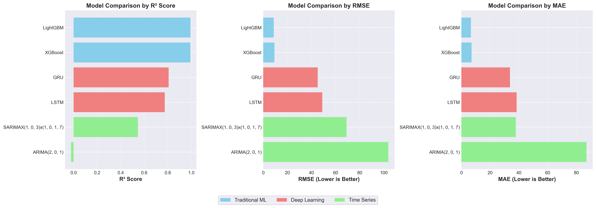
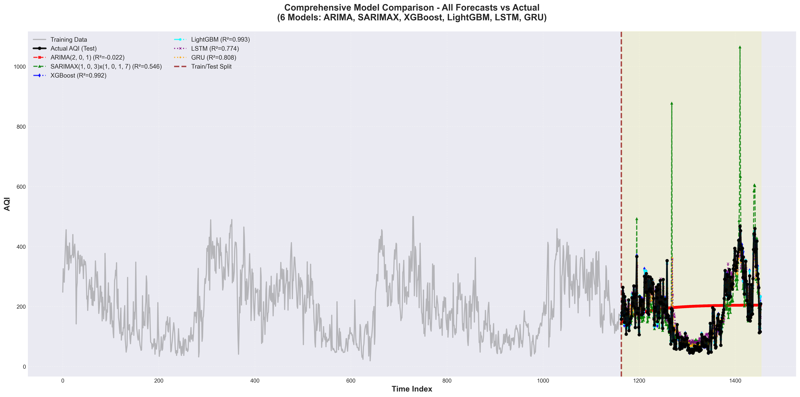
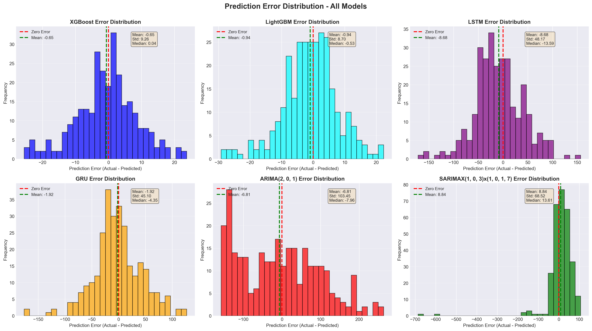
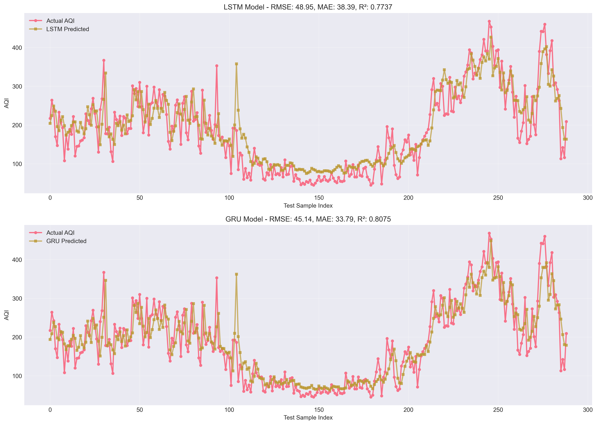

# Air Quality Index (AQI) Forecasting
## A Comparative Study of Machine Learning, Deep Learning, and Time Series Models


## 📋 Table of Contents
- [Overview](#overview)
- [Key Findings](#key-findings)
- [Models Implemented](#models-implemented)
- [Performance Comparison](#performance-comparison)
- [Dataset](#dataset)
- [Installation](#installation)
- [Usage](#usage)
- [Results & Visualizations](#results--visualizations)
- [License](#License)

## 🌟 Overview

This project presents a comprehensive comparison of **6 different forecasting models** for predicting Air Quality Index (AQI) using 4 years of real-world pollution data (2021-2025). The study evaluates gradient boosting methods (LightGBM, XGBoost), deep learning approaches (LSTM, GRU), and classical time series models (ARIMA, SARIMAX).

### Motivation
Air pollution causes approximately **7 million premature deaths annually** worldwide (WHO). Accurate AQI forecasting enables:
- Early warning systems for vulnerable populations
- Evidence-based policy interventions
- Optimized urban planning and traffic management
- Reduced healthcare costs through preventive measures

## 🏆 Key Findings

### Performance Hierarchy
1. **LightGBM** (Best) - RMSE: 8.75 | R²: 0.9927 ✅
2. **XGBoost** - RMSE: 9.28 | R²: 0.9918
3. **GRU** - RMSE: 45.14 | R²: 0.8075
4. **LSTM** - RMSE: 48.95 | R²: 0.7737
5. **SARIMAX** - RMSE: 69.08 | R²: 0.5462
6. **ARIMA** (Worst) - RMSE: 103.67 | R²: -0.0220

### Major Insights
- ✨ **Gradient boosting dominates**: LightGBM achieves 80-92% error reduction compared to other approaches
- 🎯 **99.27% accuracy**: LightGBM explains 99.27% of variance in AQI predictions
- ⚡ **Deep learning underperforms**: On tabular time series data with ~1,400 samples, tree-based methods significantly outperform neural networks
- 📉 **Classical methods fail**: ARIMA produces negative R², performing worse than simply predicting the mean
- 🚀 **Production-ready**: LightGBM/XGBoost are optimal for operational deployment (RMSE < 10 AQI units)

## 🤖 Models Implemented

### 1. Gradient Boosting Methods
- **LightGBM**: Light Gradient Boosting Machine with GOSS and EFB
- **XGBoost**: Extreme Gradient Boosting with regularization

### 2. Deep Learning Models
- **LSTM**: Long Short-Term Memory networks
- **GRU**: Gated Recurrent Units

### 3. Time Series Models
- **ARIMA**: AutoRegressive Integrated Moving Average
- **SARIMAX**: Seasonal ARIMA with Exogenous variables

## 📊 Performance Comparison

| Model | RMSE ↓ | MAE ↓ | R² ↑ | Error Reduction vs ARIMA |
|-------|--------|-------|------|--------------------------|
| **LightGBM** | **8.75** | **6.60** | **0.9927** | **91.6%** ✅ |
| XGBoost | 9.28 | 7.10 | 0.9918 | 91.0% |
| GRU | 45.14 | 33.79 | 0.8075 | 56.5% |
| LSTM | 48.95 | 38.39 | 0.7737 | 52.8% |
| SARIMAX | 69.08 | 37.78 | 0.5462 | 33.4% |
| ARIMA | 103.67 | 86.98 | -0.0220 | - |

### Why LightGBM Wins?
- 🎯 Near-zero prediction bias (mean error: -0.94)
- ⚡ Fastest training speed (GOSS + EFB algorithms)
- 💾 Low memory footprint
- 🔧 Handles missing values naturally
- 🎨 Automatic feature interaction detection
- 📈 Robust to outliers and extreme events

## 📁 Dataset

### Description
- **Time Period**: January 2021 - January 2025 (4 years)
- **Frequency**: Daily measurements
- **Total Observations**: ~1,461 data points
- **Features**: PM2.5, PM10, NO2, SO2, CO, Ozone
- **Target Variable**: AQI (Air Quality Index)

### Data Split
- **Training Set**: 2021-01-01 to 2024-09-30 (80%)
- **Test Set**: 2024-10-01 to 2025-01-01 (20%)

### Key Characteristics
- High volatility with AQI ranging 25-500
- Strong seasonal patterns (winter peaks)
- Multiple extreme pollution episodes (AQI > 400)
- Declining trend from 2021 to 2024

## 🚀 Installation

### Prerequisites
```bash
Python 3.8+
pip or conda
```

### Clone Repository
```bash
git clone https://github.com/longway2go-ai/AQI-Forecasting.git
cd AQI-Forecasting
```

### Install Dependencies
```bash
pip install -r requirements.txt
```

Or using conda:
```bash
conda env create -f environment.yml
conda activate aqi-forecasting
```

## 📈 Results & Visualizations

### Model Performance Comparison


### Time Series Forecasts


### Error Distribution Analysis


### Training Curves


### Key Visualizations
- **AQI Time Series**: Complete 4-year pollution trends
- **Correlation Heatmap**: Inter-pollutant relationships
- **Seasonal Decomposition**: Trend, seasonal, and residual components
- **Forecast Comparison**: All 6 models vs actual AQI
- **Error Distribution**: Prediction bias and variance analysis
- **Performance Metrics**: RMSE, MAE, R² across all models

## 🛠️ Dependencies

### Core Libraries
```
Python >= 3.8
NumPy >= 1.21.0
Pandas >= 1.3.0
Matplotlib >= 3.4.0
Seaborn >= 0.11.0
Scikit-learn >= 1.0.0
```

### Machine Learning
```
LightGBM >= 3.3.0
XGBoost >= 1.5.0
TensorFlow >= 2.8.0 (for LSTM/GRU)
Keras >= 2.8.0
```

### Time Series
```
Statsmodels >= 0.13.0
pmdarima >= 1.8.5 (auto_arima)
```

### Utilities
```
Jupyter >= 1.0.0
tqdm >= 4.62.0
joblib >= 1.1.0
```

See `requirements.txt` for complete list with specific versions.

## 📄 License

This project is licensed under the MIT License - see the [LICENSE](LICENSE) file for details.

```
MIT License

Copyright (c) 2025 Arnab Deogharia

Permission is hereby granted, free of charge, to any person obtaining a copy
of this software and associated documentation files (the "Software"), to deal
in the Software without restriction, including without limitation the rights
to use, copy, modify, merge, publish, distribute, sublicense, and/or sell
copies of the Software, and to permit persons to whom the Software is
furnished to do so, subject to the following conditions:

The above copyright notice and this permission notice shall be included in all
copies or substantial portions of the Software.
```

---

**Note**: This is an academic research project. For production deployment, please ensure compliance with local regulations and conduct thorough validation with domain experts.

**Last Updated**: January 2025
